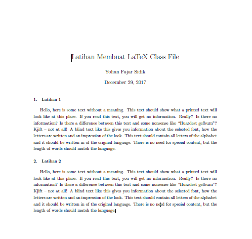

LaTeX
=================================================================================

.. contents:: **Daftar Isi**

Softwares/Packages/Tools
---------------------------------------------------------------------------------

- Tex distribution
   + `Miktex <https://miktex.org/>`_
   + `Tex live <https://tug.org/texlive/>`_
- Editor
   + `Texstudio <https://www.texstudio.org/>`_
- `Bibtex <http://www.bibtex.org/>`_
- `Glossaries <https://ctan.mc1.root.project-creative.net/macros/latex/contrib/glossaries/glossaries-user.html>`_

Command Line
---------------------------------------------------------------------------------

- basic document

::

      $ pdflatex filename

- include bibtex

::

      $ pdflatex filename
      $ bibtex filename
      $ pdflatex filename
      $ pdflatex filename

- include glossaries

::

      $ pdflatex filename
      $ makeglossaries filename
      $ pdflatex filename
      $ pdflatex filename

My Templates
---------------------------------------------------------------------------------

- `yohan_template_article.tex <templates_ysi/yohan_template_article.tex>`_
- `yohan_article.cls <templates_ysi/yohan_article.cls>`_

Snippets
---------------------------------------------------------------------------------

- `Snippets <snippets/README.rst>`_

