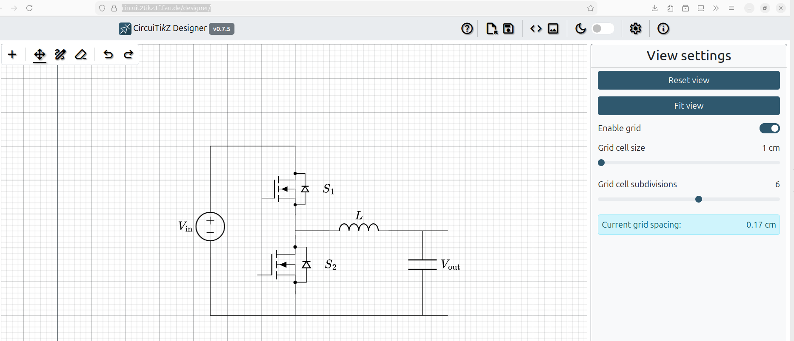
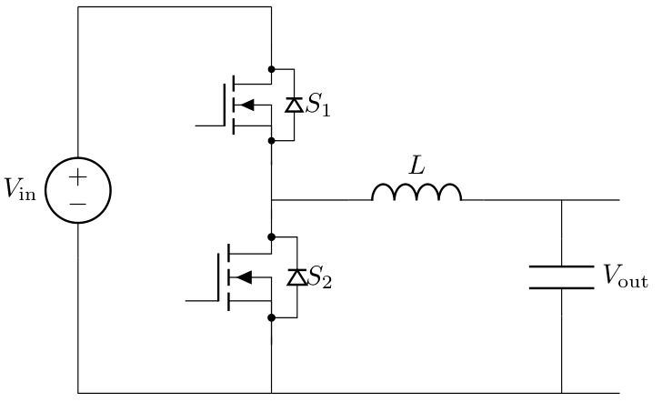

# Tikz GUI

Aplikasi berbasis web yang bernama [CircuiTikZ Designer](https://circuit2tikz.tf.fau.de/designer/) dapat digunakan untuk menggambar tikz circuit yang *code*-nya bisa diekspor dan di-*compile* menggunakan Latex.

Hasil *compile*-nya adalah:

