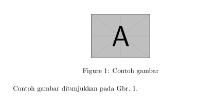
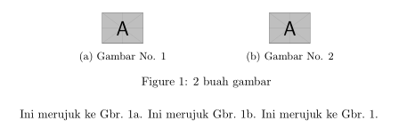
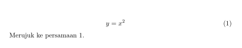
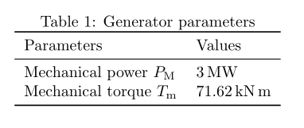

Latex Snippets
=================================================================================

:Penulis: Yohan Sidik

.. contents:: **Daftar Isi**

Basic Document Templates
---------------------------------------------------------------------------------

Basic document 
*********************************************************************************

::

	\documentclass{article}
	\begin{document}
	  Hello World!
	\end{document}

Basic document with bibtex 
*********************************************************************************

**Paket**

cite

**Contoh**

::

	\documentclass[11pt]{article}
	\usepackage{cite}

	\begin{document}

	\title{My Article}
	\author{Nobody Jr.}
	\date{Today}
	\maketitle

	Blablabla said Nobody ~\cite{Nobody06}.

	\bibliography{mybib}{}
	\bibliographystyle{plain}
	\end{document}

Basic document with glossaries 
*********************************************************************************

**Paket**

glossaries

**Contoh**
::

	\documentclass{article}  
	\usepackage{glossaries}  
	\makeglossaries  
	\newglossaryentry{sample}{name={sample},description={an example}}  
	\begin{document}  
	\gls{sample}, \gls[format=textbf]{sample}.  
	\printglossaries  
	\end{document}

Basic document with bibtex and glossaries
*********************************************************************************

**Paket**

=================== ======================
cite                 glossaries
=================== ======================

**Contoh**

::

	\documentclass[11pt]{article}
	\usepackage{cite}
	\usepackage{glossaries} 
	\makeglossaries  
	\newglossaryentry{sample}{name={sample},description={an example}}

	\begin{document}

	\title{My Article}
	\author{Nobody Jr.}
	\date{Today}
	\maketitle

	Blablabla said Nobody ~\cite{Nobody06}.

	\gls{sample}, \gls[format=textbf]{sample}. 

	\bibliography{mybib}{}
	\bibliographystyle{plain}
	\printglossaries  
	\end{document}

Makefile
---------------------------------------------------------------------------------

Standard Script
*********************************************************************************

Makefile berikut dapat meng-compile tex file yang berisi bibtex dan glossaries. 

::

        .PHONY: all build1 build2 build3 bib gls

        all: build1 bib gls build2 build3

        build1:
	        pdflatex main

        build2:
	        pdflatex main

        build3:
	        pdflatex main

        bib:
	        bibtex main
	
        gls:
	        makeglossaries main

Script dengan tambahan fitur untuk menyimpan auxiliary files di folder build
*********************************************************************************

::

        .PHONY: all build1 build2 build3 bib gls

        all: build1 bib gls build2 build3

        build1:
	        pdflatex -output-directory=build -interaction=batchmode main

        build2:
	        pdflatex -output-directory=build -interaction=batchmode main

        build3:
	        pdflatex -output-directory=build -interaction=batchmode main

        bib:
	        biber --input-directory=build --output-directory=build main

        gls:
	        makeglossaries -d build main

Alternatif Penulisan Makefile Versi 1
*********************************************************************************

Pada contoh di atas, setiap line command ditulis dalam rule yang terpisah. Semua
line tersebut sebenarnya dapat ditulis dalam rule yang sama. Contohnya adalah:

::

        .PHONY: all

        all:
	        pdflatex -output-directory=build -interaction=batchmode main
	        biber --input-directory=build --output-directory=build main
	        makeglossaries -d build main
	        pdflatex -output-directory=build -interaction=batchmode main
	        pdflatex -output-directory=build -interaction=batchmode main

Alternatif Penulisan Makefile Versi 2
*********************************************************************************

Agar dapat digunakan secara general, maka nama file yang berulang diganti dengan
variabel untuk memudahkan dalam mengganti nama file tersebut. 

::

        .PHONY: update all

        auxFolder := build
        mode      := batchmode
        filename  := main

        update:
                @echo "simple update"
                @echo "-------------"
                pdflatex -output-directory=$(auxFolder) -interaction=$(mode) $(filename)

        all:
                @echo "run pdflatex (1)"
                @echo "----------------"
                pdflatex -output-directory=$(auxFolder) -interaction=$(mode) $(filename)
                @echo "run biber"
                @echo "---------"
                biber --input-directory=$(auxFolder) --output-directory=$(auxFolder) $(filename)
                @echo "run glossaries"
                @echo "--------------"
                makeglossaries -d $(auxFolder) $(filename)
                @echo "run pdflatex (2)"
                @echo "----------------"
                pdflatex -output-directory=$(auxFolder) -interaction=$(mode) $(filename)
                @echo "run pdflatex (3)"
                @echo "----------------"
                pdflatex -output-directory=$(auxFolder) -interaction=$(mode) $(filename)

Otomatis Compile
*********************************************************************************

Untuk compile otomatis apabila ada perubahan pada isi folder. 

::

	#Makefile for compiling tex by Yohan Sidik
	#Change-log
	#23-10-2020: organize the script
	#24-10-2020: only aux files stored in the build folder; main.pdf is in the root folder

	.PHONY: update all watch

	auxFolder := build
	mode      := nonstopmode
	filename  := main

	#mode options
	# 1. batchmode 
	# 2. nonstopmode

	watch:
		while true; do \
			inotifywait -qre close_write contents; \
			make update; \
		done
		
	update:
		@echo "simple update"
		@echo "-------------"
		pdflatex -aux-directory=$(auxFolder) -interaction=$(mode) $(filename)

	all: 
		@echo "run pdflatex (1)"
		@echo "----------------"
		pdflatex -aux-directory=$(auxFolder) -interaction=$(mode) $(filename)
		@echo "run biber"
		@echo "---------"
		biber --input-directory=$(auxFolder) --output-directory=$(auxFolder) $(filename)
		@echo "run glossaries"
		@echo "--------------"
		makeglossaries -d $(auxFolder) $(filename)
		@echo "run pdflatex (2)"
		@echo "----------------"
		pdflatex -aux-directory=$(auxFolder) -interaction=$(mode) $(filename)
		@echo "run pdflatex (3)"
		@echo "----------------"
		pdflatex -aux-directory=$(auxFolder) -interaction=$(mode) $(filename)

**Referensi**

- `Hiding latex metafiles <https://texblog.org/2015/08/20/hiding-latex-metafiles-from-project-directory/>`_

Makefile dan Docker
*********************************************************************************

Simple command:

::

	compile:
		docker run --rm -v $(shell pwd):/workdir -w /workdir aergus/latex pdflatex -output-directory=build main.tex

Pilihan image:

- aergus/latex
- tianon/latex

Figures
---------------------------------------------------------------------------------

1 Figure
*********************************************************************************

**Paket**

graphics

**Contoh**

::

	\documentclass{article}
	\usepackage{graphicx}

	\begin{document}

	\begin{figure}[!hb]
		\centering
		\includegraphics[width=3cm]{example-image-a}
		\caption{Contoh gambar}
		\label{fig:main}
	\end{figure}

	Contoh gambar ditunjukkan pada Gbr.~\ref{fig:main}. 

	\end{document}

**Hasil compile**

2 Figures
*********************************************************************************

**Paket**

============== ================ ==================
graphicx        caption          subcaption
============== ================ ==================

**Contoh**

::

	\documentclass{article}
	\usepackage{graphicx}
	\usepackage{subcaption}
	\usepackage{caption}

	\begin{document}

	\begin{figure}[!ht]
		\centering
		\begin{subfigure}[t]{.4\linewidth}
			\centering
			\includegraphics[width=0.25\textwidth]{example-image-a}
			\caption{Gambar No. 1}\label{fig:a}
		\end{subfigure}
		\begin{subfigure}[t]{.4\linewidth}
			\centering
			\includegraphics[width=0.25\textwidth]{example-image-a}
			\caption{Gambar No. 2}\label{fig:b}
		\end{subfigure}
	\caption{2 buah gambar}\label{fig:contoh}
	\end{figure}

	Ini merujuk ke Gbr.~\ref{fig:a}. Ini merujuk Gbr.~\ref{fig:b}. Ini merujuk ke
	Gbr.~\ref{fig:contoh}.

	\end{document}

**Hasil compile**

Equation
---------------------------------------------------------------------------------

**Contoh**

::

	\documentclass{article}

	\begin{document}

	\begin{equation}
	   \label{eq:contoh}
	   y=x^2
	\end{equation}

	Merujuk ke persamaan \ref{eq:contoh}. 

	\end{document}

**Hasil compile**

Table
---------------------------------------------------------------------------------

**Paket**

=============== ===============
 booktabs        siunitx
=============== ===============

**Contoh**

::

	\documentclass{article}
	\usepackage[utf8]{inputenc}
	\usepackage{booktabs}
	\usepackage{siunitx}

	\begin{document}

	\begin{table}[!h]
		\caption{Generator parameters}
		\label{tab:genparameters}
		\centering
		\begin{tabular}{ll}
			\toprule
			Parameters & Values \\
			\midrule
			Mechanical power $P_{\mathrm{M}}$ & \SI{3}{\mega\watt} \\
			Mechanical torque $T_{\mathrm{m}}$ & \SI{71.62}{\kilo\newton\meter} \\
			\bottomrule
		\end{tabular}
	\end{table}

	\end{document}

**Hasil compile**

.. footer:: Yohan Sidik
